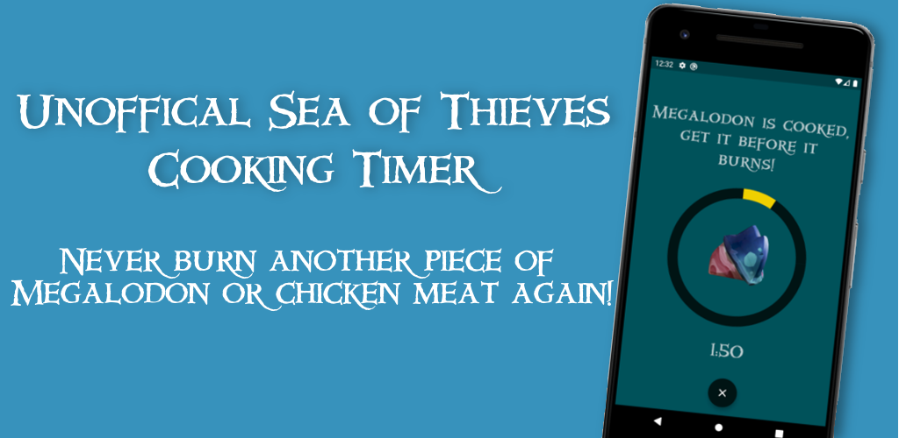

# [Sea of Thieves Cooking Timer](https://play.google.com/store/apps/details?id=uk.ryanlaycock.sottimer)

_"SoT Cooking Timer is a handy unofficial companion app to be used alongside the PC and Xbox game, Sea of Thieves."_

A simple Android application written in dart using the Flutter framework. The app is currently published to the [Google Play Store](https://play.google.com/store/apps/details?id=uk.ryanlaycock.sottimer) and as of March 2021 has over **10k downloads** and a **4.7 star rating** (from 74 reviews).

## Description
> Completely free and with zero adverts, the SoT Cooking Timer is a handy unofficial companion app to be used alongside the PC and Xbox game, Sea of Thieves.  
>
> Ever survived the Kraken, harpooned the pieces of meat and started cooking them, only to be distracted and ultimately forgetting about them until you're welcomed by the sight of your hard work going up in smoke? Then this app is for you!
>
> Whether you're a Pirate Legend or a complete beginner, when sailing the Sea of Thieves there's always something to distract you from the Trophy Splashtail that's cooking below deck. With this app you can simply set the timer when you begin cooking, and it'll alert you with a friendly chicken cluck when the meat is ready, and let you know how long you have before it starts to burn!
>
> Timings are built in for all the different meats, including the time between cooked and burnt, giving you confidence to continue raising the anchor for those extra couple of seconds.
> 
> So get out there in the Sea of Thieves, and bring Merrick a haul of perfectly cooked meat!

